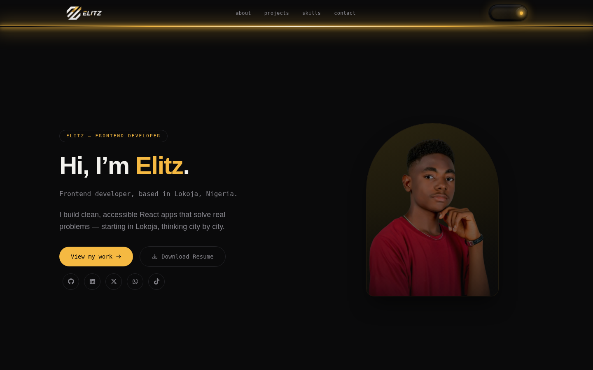

<div align="center">



# Elitz — Developer Portfolio

**A dark room. A single switch. Curiosity switched on.**

[](https://react.dev)
[](https://vitejs.dev)
[](https://tailwindcss.com)
[](https://www.framer.com/motion/)
[](#license)

[Live Demo](#) · [Report a Bug](https://github.com/OlatundeEmmanuelTantolorun/elitz-portfolio/issues) · [Contact](#contact)

</div>

---

## About

This is my personal developer portfolio, built around one idea: **light reveals the room, curiosity reveals what's possible.**

The site loads in darkness. A single switch — the one visual focal point — is the only way in. Flip it, and the page ignites: a light source under the navbar spreads down through the page, ghost-opacity content resolves into full color, and a portrait fades in from grayscale as the light reaches it. Flip it off, and the room dims back to black at its own, calmer pace — it isn't just the reveal animation played in reverse.

Everything downstream of that one interaction — the badge, the headline, the project cards, the skills grid, the contact section — is driven by a single `lightLevel` value (0 → 1), not a set of separately-timed animations. One state, one source of truth, one motion.

## Features

- 🕯️ **Signature light-reveal system** — a single state machine (`dark → igniting → lit → dimming → dark`) drives every visual on the page from one shared value
- 🎛️ **Physical-feeling switch** — a dark, bezel-and-knob toggle living permanently in the navbar
- 🖼️ **Ghost-opacity content** — sections sit at ~3% opacity in the dark and resolve into full color as the light reaches them, so the page feels *revealed*, not loaded
- 📱 **Fully responsive** — a dedicated mobile treatment for the portrait and layout, not just a squeezed desktop view
- ♿ **Accessible by default** — keyboard-operable switch (`role="switch"`, `aria-checked`), visible focus states, and `prefers-reduced-motion` support throughout
- 🗂️ **Real project data** — every project card links to a live deployment and a real GitHub repo
- 💬 **Direct contact options** — email, WhatsApp (with a pre-filled message), GitHub, LinkedIn, X, and TikTok, all wired to real accounts

## Tech Stack

| Layer | Choice |
|---|---|
| Framework | React 19 + Vite |
| Styling | Tailwind CSS v4 (theme tokens via `@theme`, no `tailwind.config.js` color overrides) |
| Motion | Framer Motion — a single `lightLevel` motion value drives every animated surface |
| Icons | React Icons (`react-icons/fa6`, `react-icons/hi`) |
| Deployment | Vercel / Netlify |

## Project Structure

```text
src/
├── components/
│   ├── layout/       # Navbar, Footer
│   ├── ui/            # LightSwitch
│   └── effects/
│       └── LightReveal.jsx   # the light source + vignette overlay
├── sections/          # Hero, About, Projects, Skills, Contact
├── data/               # projects.js, skills.js, about.js, contact.js
├── hooks/
│   └── useLightReveal.js     # the state machine — single source of truth
├── context/
│   └── LightContext.jsx      # distributes light state via Provider
└── App.jsx
```

## Getting Started

### Prerequisites

- Node.js 18+
- npm

### Installation

```bash
git clone https://github.com/OlatundeEmmanuelTantolorun/elitz-portfolio.git
cd elitz-portfolio
npm install
```

### Development

```bash
npm run dev
```

### Production Build

```bash
npm run build
npm run preview   # preview the production build locally
```

## The Light System, Briefly

The whole interaction lives in one hook:

```text
useLightReveal()
  → phase: 'dark' | 'igniting' | 'lit' | 'dimming'
  → lightLevel: a 0–1 motion value
  → toggle(): flips the switch, locked mid-transition so a double-click can't break it
```

Every visual — the navbar glow, the hero content, the ghost-opacity sections, the portrait's grayscale-to-color filter — reads from that same `lightLevel` and interpolates its own opacity, position, or filter from it. Nothing plays a separately-timed, hardcoded animation sequence.

## Contact

**Emmanuel Olatunde** — known as **Elitz**

- Email: [olatundeemmanueldev@gmail.com](mailto:olatundeemmanueldev@gmail.com)
- WhatsApp: [+234 906 688 2533](https://wa.me/2349066882533)
- GitHub: [@OlatundeEmmanuelTantolorun](https://github.com/OlatundeEmmanuelTantolorun)
- LinkedIn: [Emmanuel Tantolorun](https://www.linkedin.com/in/emmanuel-tantolorun-93244b3ab/)
- X: [@elitz_dev](https://x.com/elitz_dev)

## License

MIT — see [LICENSE](LICENSE) for details.

---

<div align="center">
<sub>Built with React, Vite, Tailwind CSS, and Framer Motion. Designed and coded by Elitz.</sub>
</div>
