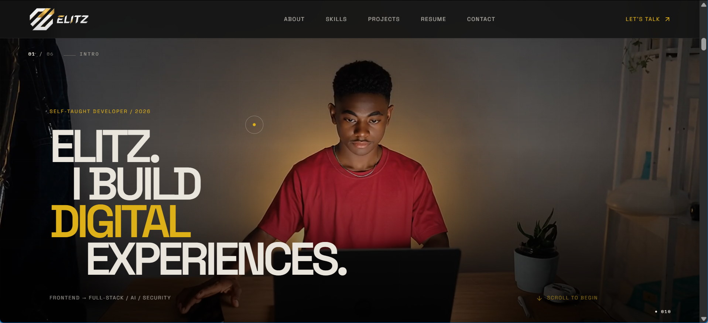

<div align="center">



# Elitz — Developer Portfolio

**A dark room. A single switch. Curiosity switched on.**

[](https://react.dev)
[](https://vitejs.dev)
[](https://tailwindcss.com)
[](https://www.framer.com/motion/)
[](#license)

[Live Demo](#) · [Report a Bug](https://github.com/OlatundeEmmanuelTantolorun/elitz-portfolio/issues) · [Contact](#contact)

</div>

---

## Overview

This is the personal developer portfolio of **Emmanuel Olatunde, known as Elitz**.

The experience is built around a simple visual idea: the site begins in darkness and a single switch reveals the interface. As the light expands, the portfolio gradually resolves from muted, low-opacity content into its full visual state.

The reveal is coordinated through shared motion state rather than a collection of unrelated entrance animations. That keeps the interaction cohesive while allowing each section to respond in its own way.

## Highlights

- **Signature light reveal** with a shared `lightLevel` motion value.
- **Responsive presentation** with dedicated mobile treatment where needed.
- **Scroll-driven motion** powered by GSAP and ScrollTrigger.
- **Smooth scrolling** through Lenis.
- **Project-driven content** stored separately from presentation components.
- **Accessible interaction patterns** including keyboard-friendly controls and reduced-motion considerations.
- **Direct contact links** for email, WhatsApp, GitHub, LinkedIn, X, and TikTok.

## Tech Stack

| Area | Technology |
| --- | --- |
| Framework | React 19 |
| Build tool | Vite 8 |
| Styling | Tailwind CSS v4 |
| Motion | GSAP, Framer Motion |
| Smooth scrolling | Lenis |
| Icons | Lucide React, React Icons |
| Deployment | Vercel / Netlify |

## Project Structure

```text
.
├── docs/
│   └── assets/              # README and repository documentation assets
├── public/
│   ├── assets/              # Public branding assets
│   ├── hero-sequence/       # Hero image sequence assets
│   ├── hero-desktop.mp4     # Desktop hero media
│   ├── hero-mobile.mp4      # Mobile hero media
│   └── resume.pdf            # Public resume
├── src/
│   ├── assets/              # Imported source assets
│   ├── components/
│   │   ├── effects/         # Cursor, loader, marquee, scroll effects
│   │   ├── layout/          # Site-level layout/navigation
│   │   ├── sections/        # Main portfolio sections
│   │   └── ui/              # Reusable presentation components
│   ├── data/                # Portfolio content and contact data
│   ├── layouts/             # Page composition
│   ├── lib/                 # Shared utilities and integrations
│   ├── App.jsx
│   ├── index.css
│   └── main.jsx
├── .github/
├── index.html
├── package.json
├── .gitignore
├── LICENSE
└── README.md
```

The structure separates **what the site does** from **what the site displays** without introducing a new architectural layer. Existing component behavior remains unchanged.

## Getting Started

### Requirements

- Node.js 18+
- npm

### Installation

```bash
git clone https://github.com/OlatundeEmmanuelTantolorun/elitz-portfolio.git
cd elitz-portfolio
npm install
```

### Development

```bash
npm run dev
```

### Production build

```bash
npm run build
npm run preview
```

### Lint

```bash
npm run lint
```

## Hero Media

The hero currently uses separate desktop and mobile video assets from `public/`:

```text
public/hero-desktop.mp4
public/hero-mobile.mp4
```

Keeping these files in `public/` allows the existing runtime paths to remain stable.

## Contact

**Emmanuel Olatunde** — **Elitz**

- Email: [olatundeemmanueldev@gmail.com](mailto:olatundeemmanueldev@gmail.com)
- WhatsApp: [+234 906 688 2533](https://wa.me/2349066882533)
- GitHub: [@OlatundeEmmanuelTantolorun](https://github.com/OlatundeEmmanuelTantolorun)
- LinkedIn: [Emmanuel Tantolorun](https://www.linkedin.com/in/emmanuel-tantolorun-93244b3ab/)
- X: [@elitz_dev](https://x.com/elitz_dev)
- TikTok: [@elitz_dev01](https://www.tiktok.com/@elitz_dev01)

## License

MIT. See [LICENSE](LICENSE) for details.

---

<div align="center">
<sub>Built with React, Vite, Tailwind CSS, GSAP, Framer Motion, and Lenis. Designed and coded by Elitz.</sub>
</div>
